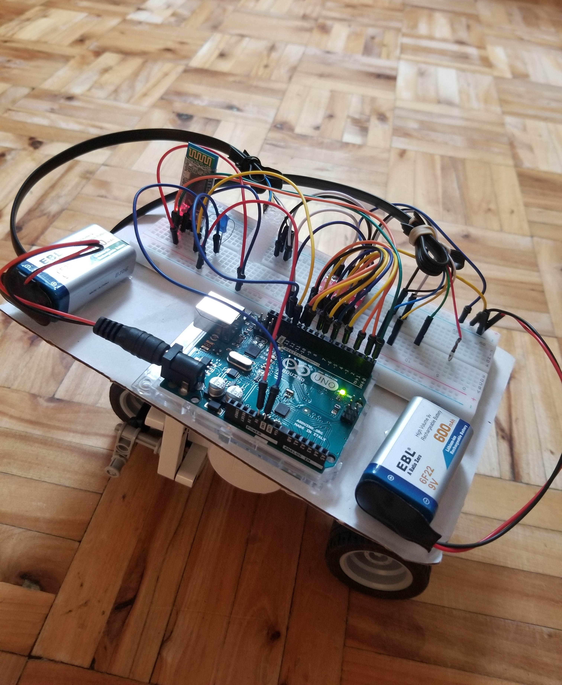
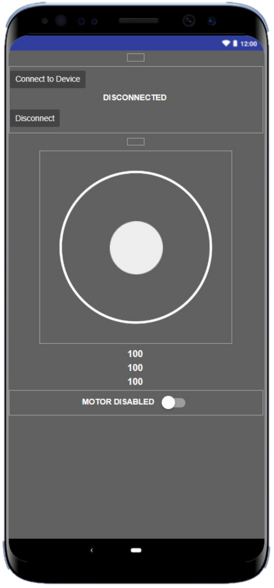

## Remote Controlled Rover

Inspired by [this](https://www.hackster.io/mtashiro/autobot-using-lego-nxt-motors-and-sensor-56ad60) project I built a remote controlled lego rover

you can check my demo [here](https://youtu.be/P9txdzXieUw) (turn subtitles ON, because I mumble xD)

## Materials Used
- Arduino UNO
- HC-05 bluetooth Adapter
- Toshiba TB6612FNG dual motor driver
- A Blue LED
- 2x 9V batteries
- 3x LEGO NXT motors
- A breadoard and wires

## Software

- Arduino IDE
- Kodular for the app

## Documentation

- Helpful [documentation](https://www.philohome.com/nxt.htm) on the NXT series 
- Arduino Uno [documentation](https://docs.arduino.cc/resources/datasheets/A000066-datasheet.pdf)
- HC-05 Bluetooth Adapter [documentation](datasheets/hc-05-user-instructions-bluetooth.pdf)
- TB6612FNG motor driver [documentation](https://toshiba.semicon-storage.com/info/TB6612FNG_datasheet_en_20141001.pdf?did=10660&prodName=TB6612FNG)

